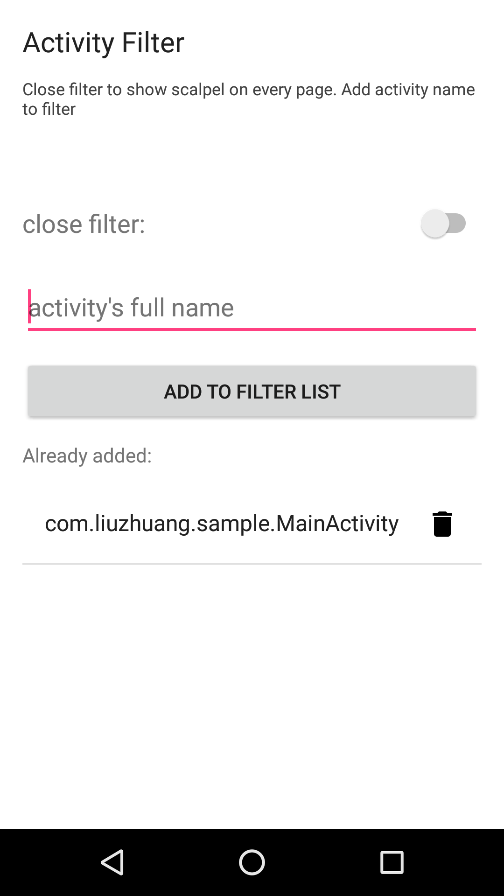

# What is EZScalpel
A library that can inspector view in 3D mode.
It is a wrapper of [https://github.com/JakeWharton/scalpel](https://github.com/JakeWharton/scalpel). Instead of add ScalpelFrameLayout to every layout file, this libray has less coupling with existed code.

# How to use

1. Add dependency to your `build.gradle`:

		com.liuzhuang.opensource:ezscalpel:0.0.5

2. Add this code to your custome `Application's onCreate()`:

    	EZScalpel.getInstance().setUp(this);

# Effect

# Filter

After including the library, your launcher will have an icon as same as your app with name "EZFilter". Close filter switch to show EZScalpel on every page. Add a full activity name to show EZScalpel only on expected pages.

# License

	Copyright 2015 Liu Zhuang

	Licensed under the Apache License, Version 2.0 (the "License");
	you may not use this file except in compliance with the License.
	You may obtain a copy of the License at

   		http://www.apache.org/licenses/LICENSE-2.0

	Unless required by applicable law or agreed to in writing, software
	distributed under the License is distributed on an "AS IS" BASIS,
	WITHOUT WARRANTIES OR CONDITIONS OF ANY KIND, either express or implied.
	See the License for the specific language governing permissions and
	limitations under the License.
